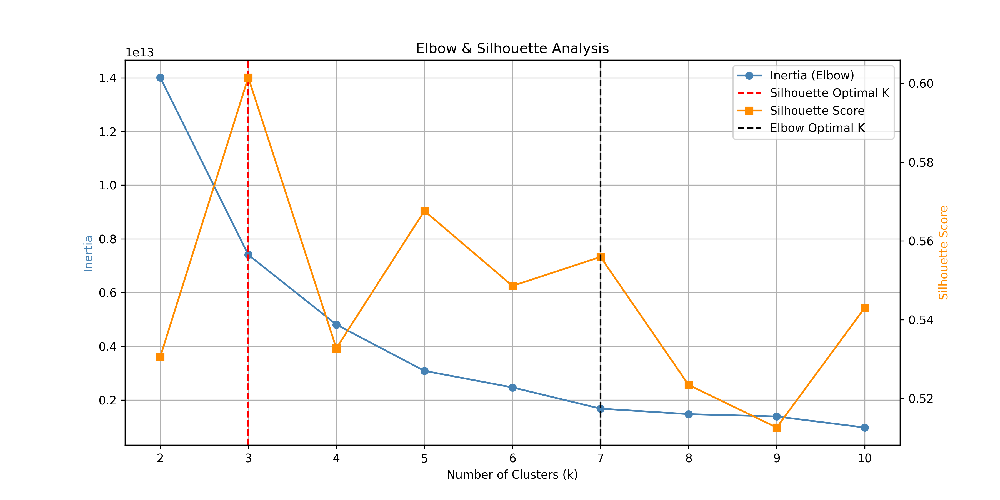

# TravelTide — Kundensegmentierung & Perk-Empfehlungssystem


End-to-End-Datenanalyseplattform, die Rohdaten eines Reiseanbieters in umsetzbare Geschäftsentscheidungen verwandelt: Nutzerverhalten analysieren, Kunden segmentieren und gezielte Perks zuweisen, um Engagement und Umsatz zu optimieren.

> Präsentation und Bericht: siehe `reports/docs/`.

---

## 🎯 Problemstellung

TravelTide möchte sein Loyalty-Programm verbessern, weiß aber nicht, welche Kundengruppen welche Vorteile (Perks) erhalten sollten. Ziel: datengetriebene Segmente bilden und jedem Segment den wirkungsvollsten Perk zuordnen.

## 🗂️ Daten

Vier Quelltabellen (`users`, `sessions`, `flights`, `hotels`), aufbereitet über SQL und eine modulare Python-Pipeline zu Nutzerkennzahlen (Engagement, Ausgaben, Häufigkeit).

## 🧪 Methoden

- **Datenaufbereitung:** Sitzungsaggregation, Feature Engineering, Imputation, Ausreißerbehandlung, statistische Validierung.
- **Segmentierung (zwei Ansätze):**
  - *Machine Learning:* K-Means-Clustering mit PCA, Elbow-Methode und Silhouetten-Analyse zur Clusterbestimmung.
  - *Regelbasiert:* RFM-Analyse (Recency, Frequency, Monetary) und Engagement-Scoring.
- **Perk-Zuteilung:** segment-spezifische Empfehlungen inkl. Kosten-Nutzen- und ROI-Analyse.

## 📈 Ergebnisse



- Identifikation klar abgegrenzter, hochwertiger Nutzersegmente.
- Jedem Segment ein datenbasierter Perk zugeordnet, bewertet nach erwartetem ROI.
- Vollständige, reproduzierbare Pipeline von den Rohdaten bis zur Präsentation.

*(Details und alle Visualisierungen im Ordner `reports/`.)*

## 🛠️ Setup

```bash
git clone https://github.com/Sadiq422/Traveltide_projekt.git
cd Traveltide_projekt
pip install -r requirements.txt
# Rohdaten in data/raw/ ablegen: flights.csv, hotels.csv, sessions.csv, users.csv
```

Workflow:

```bash
python -m core.load_data            # Datenaufbereitung
jupyter notebook                    # notebooks/eda.ipynb, kmean_cluster.ipynb, ...
python -m core.perk_assignment      # Perk-Zuteilung
```

## 🏗️ Projektstruktur

```
core/        # Module: load_data, eda, advance_metrics, segment_analyse, perk_assignment, utils
notebooks/   # eda, kmean_cluster, pca_processing, segment_analyse, perk_assignment
sql/         # session_base.sql
reports/     # Visualisierungen, Dashboards, Präsentation
```

## 🧰 Tech Stack

Python (pandas, NumPy, scikit-learn), SQL, K-Means, PCA, RFM, Matplotlib/Seaborn, Jupyter.

## 👤 Autor

**Sadiq Qais** — Junior Data Scientist & Data Analyst
[LinkedIn](https://www.linkedin.com/in/sadiq-qais) · qais.sadiq422@gmail.com

## 📄 Lizenz

MIT — siehe `LICENSE`.
